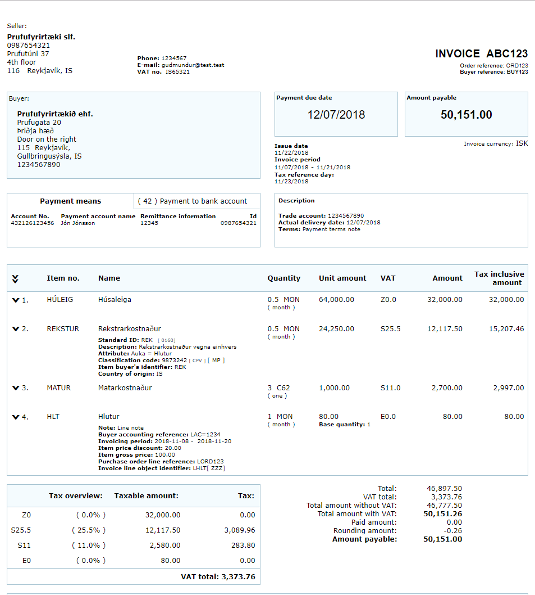

# README - UniStyles

 
This template is being implemented by Unimaze Software with feedback from the FUT Technical Committee of Icelandic Standards, which 
is a member of the European standards organizations CEN, CENELEC and ETSI as well as the international standards organizations ISO and IEC.

Common language files were derived and adapted from the work of SFTI in Sweden and OIOUBL in Denmark. Layout and visual appearance was inspired from the work of the  Authoritiy of Iceland and Icelandic Standards.

As part of the POOL-TSPs project and during its duration, the work been co-financed by the European Commission through its eInvoicing 2017 CEF Telecom Call, CEF-TC-2017-3.

## Objectives
The implementation of this template aims to:
- Provide easy visual access to most relevant data for the accountant.
- Distinguish easily between invoice and credit note.
- Suppport most XSLT processors.
- Be purely HTML and CSS based (no Javascript shall be used).

## Features
List of features:
- Invoice and credit note are rendered in different colors.
- Line details can be shown (expanded) or hidden (collapsed).
- Language support: English, Swedish, Polish and Icelandic. Please create pull requests or contact us for adding new translations.

## Licensing
Apache License 2.0

See [LICENSE](LICENSE.txt) for the full text.

### Samples
See [samples](docs/samples) files.

  
  &#160;&#160;&#160;&#160;&#160;&#160;
  

## Requirements
Currently this stylesheet requires XSLT 1.0 and has been tested with Saxon v9.7 & v9.9 and MSXML 3.0.

To trigger the transformation from UBL XML to HTML type via commandline type at project root level:
<code>mvn clean install</code>

* The UBL test input files are in the directory: [src/test/resources/ubl21](src/test/resources/ubl21).
* The XSL stylesheets are in the directory: [src/main/resources/xslt/html](src/main/resources/xslt/html).
* The HTML output will be created in the directory: [target/generated-resources/xml/xslt](target/generated-resources/xml/xslt).

## Adding a new language
In order to add another language to the stylesheet, there are a few steps.

`*` is your language code

Create a file named Headlines-BT_&ast;.xml (or copy and rename Headlines-BT_en.xml)
The structure of the xml should be:

`<Semantic Model>` 
	&nbsp; &nbsp; `<BusinessTerm id= "BT or BG code">` 
		&nbsp; &nbsp; &nbsp;&nbsp;  `<TermName> The official term name in your language </Termname>` 
		&nbsp; &nbsp; &nbsp; &nbsp; `<Definition> The definition of the term </Definition> --->Optional` 
		&nbsp; &nbsp; &nbsp; &nbsp; `<Description> A description of the term </Description> --->Optional` 
		&nbsp; &nbsp; &nbsp; &nbsp; `<DisplayName> The preferred display name in the stylesheet (if abscent, the TermName will be used) - If present 
		but empty, no lead text will be shown in the stylesheet.`  
	&nbsp; &nbsp; &nbsp; &nbsp; `</DisplayName> --> Optional` 
	&nbsp; &nbsp; `</BusinessTerm>` 
`</Semantic Model>` 

Pleas make sure to add all the BusinessTerms you wish to be visible in the stylesheet, there is no fallback if a term is missing, the lead text will then be abscent.

Create files corresponding to all the relevant code lists in your language by replacing the * with your language code. 
With these code lists, there will be a fallback to english code values if the value is missing in your language.

The format of all of the code lists below are in generic code 1.0 : http://docs.oasis-open.org/codelist/ns/genericode/1.0/

The relevant code lists are:

* UBLClassificationCode_&ast;.xml --> Item classification identifier
* UBLInvoiceBaseType_&ast;.xml --> Base type of document: Invoice or Credit Note
* UBLPeriodDescriptionCode_&ast;.xml --> Invoice period description code
* UBLTaxCategoryCode_&ast;.xml --> Tax category code
* UNCL1001_&ast;.xml --> Sub-type of document
* UNCL4461_&ast;.xml --> Payment means code
* UNCL5189_&ast;.xml --> Allowance reason code
* UNCL7161_&ast;.xml --> Charge reason code
* UNECE_&ast;.xml --> Unit of measure code

## Setting the default language
Open the user_config.xsl and under the tag: `<xsl:variable name="lang" select="'*'"/>` change the `*` to your language code, corresponding to the `*` in your file names.

The language can be changed in runtime by setting the `lang` XSLT parameter when invoking the transaction.

---

